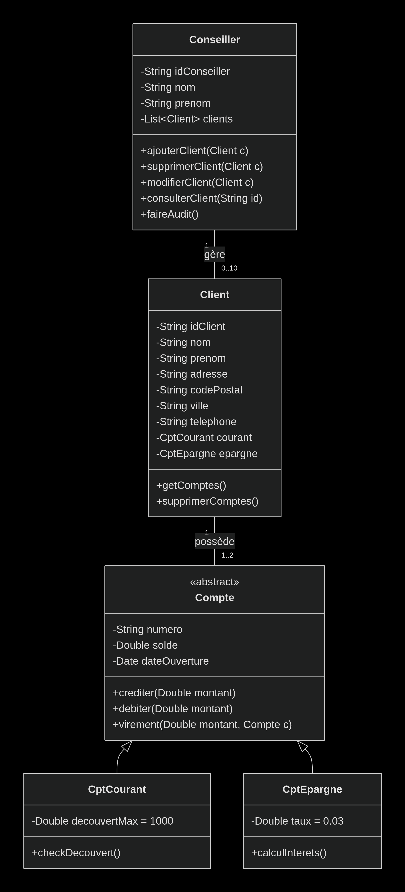

# SimpleCashSI

**SimpleCashSI** est une application back-office pour la banque **SimpleCash**, développée avec **Spring Boot, JPA et REST**.  
Elle permet aux conseillers clientèle de gérer les clients, les comptes bancaires et les services à forte valeur ajoutée comme les virements internes, l’audit et les simulations de crédits.

---

##  Objectifs du projet

- Gérer les clients (création, modification, consultation, suppression)
- Gérer les comptes bancaires (compte courant, compte épargne)
- Réaliser des opérations financières (crédit, débit, virements internes)
- Générer des rapports et audits sur les comptes
- Maintenir un code clair et moderne avec architecture en couches

---

##  User Stories

Chaque issue dans ce projet correspond à une **user story**, représentant un besoin fonctionnel concret :

- **En tant que client**, je veux créer, consulter mon solde et faire des virement. 
- **En tant que client**, je veux créer un compte courant et un compte epagne.
- **En tant que conseiller**, je veux créer, modifier, consulter et supprimer un client pour gérer mes relations clients.
- **En tant que conseiller**, je veux créditer ou débiter un compte pour gérer les opérations financières.
- **En tant que conseiller**, je veux faire des virements internes entre comptes de la banque de façon sécurisée.
- **En tant que conseiller**, je veux générer des rapports de comptes créditeurs et débiteurs pour analyser les risques.

Chaque issue créée dans ce dépôt correspond à une de ces user stories et permet de suivre le développement des fonctionnalités.

##  Structure du projet

- **Backend** : Spring Boot, JPA/Hibernate
- **REST API** : CRUD clients, comptes, opérations bancaires
- **AOP Logging** : suivi des virements internes dans le fichier logs/virements.log
- **Tests unitaires** : validation des services critiques
- **Documentation** : Swagger/OpenAPI 

---

## Diagram de classe

---

## Structure des package
org.formation.projet_ntousse_tadiha_vanisco/

├── entities/          # Entités JPA

├── repositories/      # Interfaces Spring Data

├── services/          # Logique métier

├── controllers/       # Points d'entrée REST

├── aop/              # Logging des virements

└── exceptions/       # Gestion d'erreurs

---

## Fonctionnalités Implémentées

- **Gestion des conseiller**
1. Création d'un conseiller
2. Récuperer un ou la listes des conseiller
3. Modifier un conseiller

- **Gestion des Clients**
1. CRUD complet avec validation métier
2. Suppression conditionnelle : uniquement si solde total = 0
3. Consultation du solde total et état de découvert
- **Gestion des Comptes**
1. Compte Courant : avec découvert autorisé 
2. Compte Épargne : avec taux d'intérêt
3. Opérations : crédit, débit avec vérification des fonds
- **Virements Sécurisés**
1. Transfert entre comptes avec vérifications
2. Logging AOP dans logs/virements.log
3. Validation : fonds suffisants, comptes différents
- **Audit & Rapports**
1. Rapport complet : soldes totaux, comptes créditeurs/débiteurs
- **Gestion d'Erreurs**
1. Exceptions métier personnalisées
2. Messages d'erreur clairs en français
3. Codes HTTP appropriés

